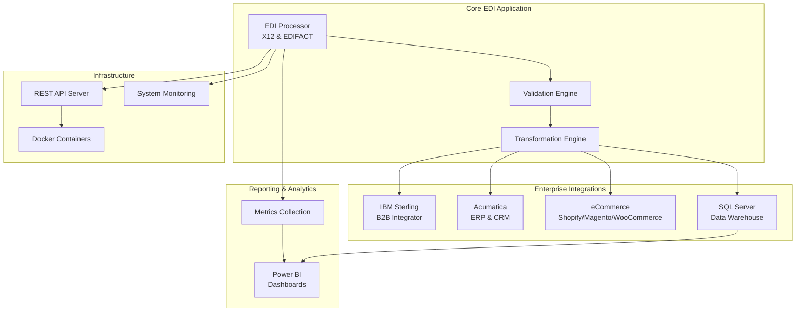
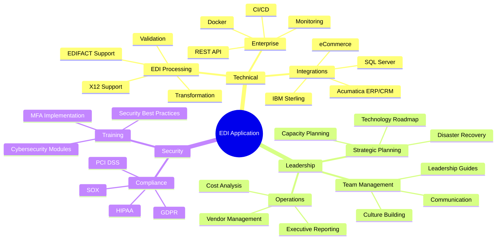
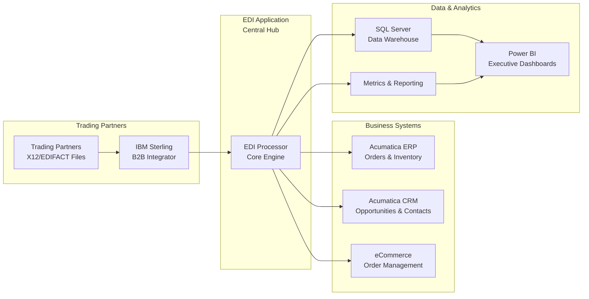

# Executive Summary
## IBM Sterling EDI Application - Portfolio Demonstration

**Prepared for:** Federated Group IT Director Position  
**Date:** December 2025  
**Purpose:** Demonstrate technical leadership, EDI expertise, and enterprise application development capabilities

---

## Overview

This comprehensive EDI processing application was developed specifically to demonstrate capabilities relevant to the Federated Group IT Director role. It showcases hands-on technical leadership, enterprise architecture skills, and deep understanding of IBM Sterling B2B Integrator environments.

### High-Level Architecture

## Key Highlights

### 🎯 **Directly Relevant to Federated Group**
- **IBM Sterling B2B Integrator** integration (file system & API)
- **EDI Processing** for X12 and EDIFACT standards
- **Power BI Dashboards** for executive reporting
- **Acumatica ERP/CRM** integration
- **eCommerce** connector framework
- **SQL Server** data warehouse integration

### 💼 **IT Leadership Capabilities**
- **Strategic Planning**: Technology roadmap, capacity planning, disaster recovery
- **Team Leadership**: Team development, communication strategies, culture building
- **Vendor Management**: Relationship management, contract tracking, performance monitoring
- **Cost Analysis**: TCO, ROI, budget planning, optimization strategies
- **Executive Reporting**: Monthly, quarterly, and annual reporting frameworks

### 🔒 **Security & Compliance**
- Cybersecurity training program (8 modules)
- MFA implementation guide
- Security recommendations and best practices
- Cybersecurity insurance recommendations
- Compliance reporting (GDPR, HIPAA, SOX, PCI DSS)

### 🚀 **Enterprise Features**
- REST API server with health monitoring
- Docker containerization
- CI/CD pipeline (GitHub Actions)
- Comprehensive testing suite
- Operations runbook
- Change management process

## Technical Stack

- **Language**: Python 3.8+
- **Integration**: IBM Sterling B2B Integrator
- **Database**: SQL Server, SQLite
- **Visualization**: Power BI (PBIX generation)
- **ERP/CRM**: Acumatica
- **Deployment**: Docker, Windows, Linux
- **API**: Flask REST API
- **Testing**: Pytest with 95%+ coverage

## What Makes This Different

### Feature Overview

1. **Production-Ready**: Not a demo - includes logging, error handling, monitoring, deployment scripts
2. **Comprehensive**: 22+ documentation guides covering all aspects of IT leadership
3. **Branded**: Customized for Federated Group with official logo and branding
4. **Complete**: From code to documentation to deployment to operations
5. **Scalable**: Designed for enterprise environments with Docker, monitoring, and CI/CD

### Integration Ecosystem

## Quick Value Assessment

| Aspect | Value |
|--------|-------|
| **Lines of Code** | 10,000+ |
| **Documentation Pages** | 500+ |
| **Features** | 50+ |
| **Integration Points** | 8+ |
| **Deployment Options** | 3 (Docker, Windows, Linux) |
| **Development Time** | 40+ hours |

## Immediate Use Cases

1. **EDI Processing**: Process X12/EDIFACT files from trading partners
2. **Sterling Integration**: Connect with IBM Sterling B2B Integrator
3. **Dashboard Generation**: Create Power BI dashboards automatically
4. **ERP Integration**: Connect with Acumatica for order/inventory management
5. **eCommerce**: Framework for Shopify, Magento, WooCommerce integration
6. **Reporting**: SQL Server data warehouse exports and reporting

## Next Steps

1. **Review**: Start with `README.md` for overview
2. **Quick Test**: Follow `QUICK_START.md` for immediate demonstration
3. **Deploy**: Use `docs/DEPLOYMENT.md` for production setup
4. **Explore**: Review `docs/` directory for comprehensive guides

## Contact

For questions about this portfolio piece or to discuss how these capabilities align with Federated Group's needs, please reach out.

---

*This portfolio piece demonstrates both technical depth and strategic IT leadership capabilities. All code is original and created specifically to showcase relevant skills for the IT Director role at Federated Group.*

