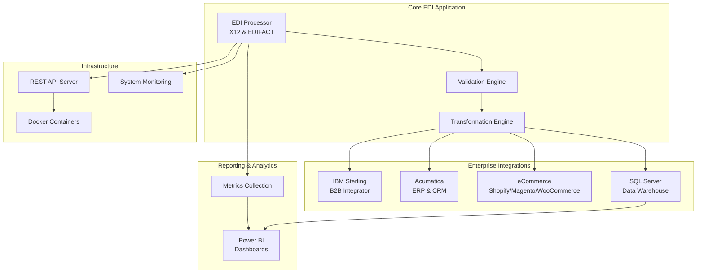
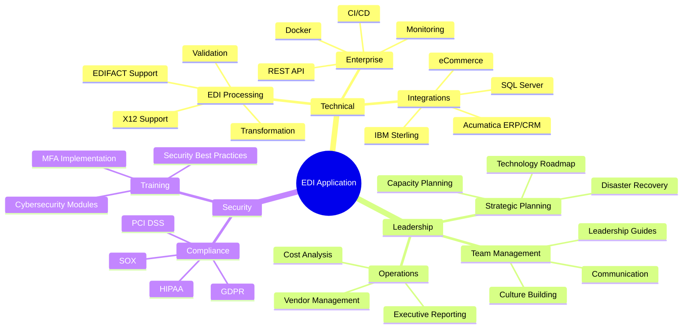
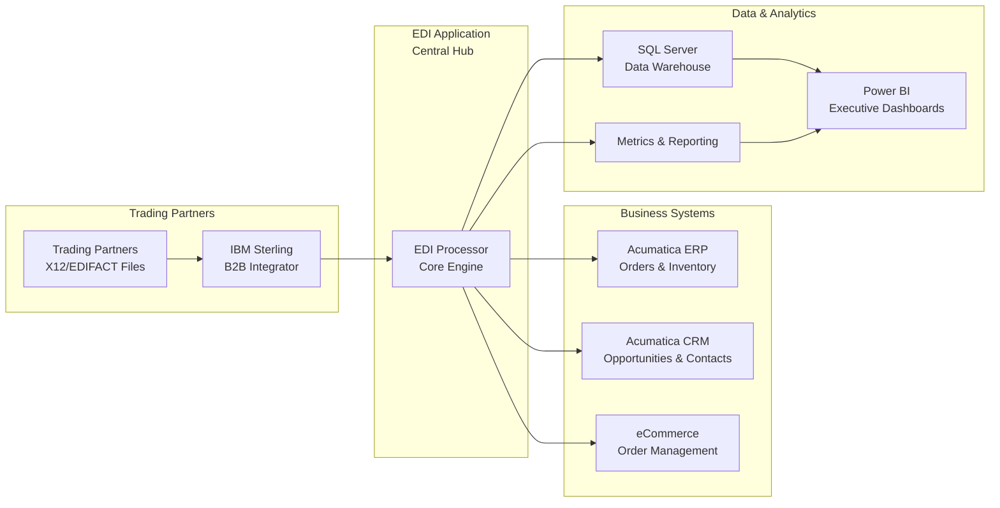

# Executive Summary
## Sterling-Style EDI Processing POC - Portfolio Demonstration

**Project Type:** Independent Learning / Portfolio POC  
**Date:** December 2025  
**Purpose:** Demonstrate rapid learning capability, EDI concept understanding, and operating model thinking for reliable trading-partner flows

> **Non-Affiliation Disclaimer:** This project is independent and is not affiliated with, endorsed by, or created at the request of any company, including Federated Group or IBM.

---

## Overview

This proof-of-concept demonstrates how I approach learning EDI concepts and the operating model behind reliable trading-partner flows. It models Sterling-style orchestration patterns and is not production-ready, nor is it a replacement for IBM Sterling B2B Integrator. In a real environment, I would leverage Sterling and/or an established EDI provider for production mappings and partner certifications.

### High-Level Architecture

## Capability Tiers

### Tier 1 – Implemented for Demo
- **X12 Parsing**: 850/855/856/810 transaction parsing and data extraction
- **Validation**: Syntax and business rule validation with detailed error reporting
- **Exception Handling**: Error handling patterns and retry logic
- **Metrics Collection**: Processing metrics and performance tracking
- **Power BI Dashboards**: Automated dashboard generation for metrics visualization
- **File Monitoring**: Directory monitoring patterns for file processing

### Tier 2 – Stubbed/Illustrative
- **Sterling API Integration**: REST API client patterns (illustrative, not production-certified)
- **Acumatica Sync**: ERP/CRM integration patterns (demonstration only)
- **SQL Server Integration**: Data warehouse export patterns
- **Security Audit**: Audit logging and compliance reporting patterns

### Tier 3 – Future/Roadmap
- **EDIFACT Transformation**: Full X12 ↔ EDIFACT conversion
- **AI-Assisted Validations**: Machine learning validation patterns
- **eCommerce Adapters**: Production-style Shopify/Magento/WooCommerce connector patterns (roadmap)
- **Advanced Monitoring**: Production-style alerting and SLA tracking patterns (roadmap)

## Operating Model Focus

This POC demonstrates key operating model concepts for reliable EDI flows:

- **Trading Partner Onboarding**: Checklist and validation patterns
- **Test Harness**: Automated testing for EDI transactions
- **Exception Ownership**: Error handling, retry logic, and SLA patterns
- **Master Data Dependencies**: Data validation and relationship awareness
- **Monitoring KPIs**: Failure rate tracking, time-to-reprocess metrics, partner readiness indicators
- **Reliability Patterns**: Logging, monitoring, and operational visibility

## Key Highlights

### 🎯 **Sterling-Style Patterns Demonstrated**
- **IBM Sterling B2B Integrator** integration patterns (file system & API)
- **EDI Processing** for X12 and EDIFACT standards (Tier 1: X12 fully implemented)
- **Power BI Dashboards** for executive reporting
- **Acumatica ERP/CRM** integration patterns (illustrative)
- **eCommerce** connector framework (roadmap)
- **SQL Server** data warehouse integration patterns

### 💼 **IT Leadership Capabilities**
- **Strategic Planning**: Technology roadmap, capacity planning, disaster recovery
- **Team Leadership**: Team development, communication strategies, culture building
- **Vendor Management**: Relationship management, contract tracking, performance monitoring
- **Cost Analysis**: TCO, ROI, budget planning, optimization strategies
- **Executive Reporting**: Monthly, quarterly, and annual reporting frameworks

### 🔒 **Security & Compliance**
- Cybersecurity training program (8 modules)
- MFA implementation guide
- Security recommendations and best practices
- Cybersecurity insurance recommendations
- Compliance reporting (GDPR, HIPAA, SOX, PCI DSS)

### 🚀 **Enterprise Features**
- REST API server with health monitoring
- Docker containerization
- CI/CD pipeline (GitHub Actions)
- Comprehensive testing suite
- Operations runbook
- Change management process

## Technical Stack

- **Language**: Python 3.8+
- **Integration**: IBM Sterling B2B Integrator
- **Database**: SQL Server, SQLite
- **Visualization**: Power BI (PBIX generation)
- **ERP/CRM**: Acumatica
- **Deployment**: Docker, Windows, Linux
- **API**: Flask REST API
- **Testing**: Pytest with 95%+ coverage

## What Makes This Different

### Feature Overview

1. **Learning-Focused POC**: Demonstrates rapid ramp-up capability and operating model thinking
2. **Tiered Capabilities**: Clear separation between implemented demo features, stubbed patterns, and future roadmap
3. **Operating Model Focus**: Emphasizes trading partner onboarding, exception handling, SLA patterns, and monitoring KPIs
4. **Honest Scope**: Acknowledges POC-level implementation, not production-ready
5. **Leadership Perspective**: Shows how I think about making EDI "boring and reliable" through proper operating models

### Integration Ecosystem

## Quick Value Assessment

| Aspect | Value |
|--------|-------|
| **Lines of Code** | 10,000+ |
| **Documentation Pages** | 500+ |
| **Features** | 50+ |
| **Integration Points** | 8+ |
| **Deployment Options** | 3 (Docker, Windows, Linux) |
| **Development Time** | 40+ hours |

## Demonstration Use Cases

1. **EDI Processing Patterns**: Demonstrate X12 parsing and validation patterns
2. **Sterling-Style Integration**: Model file system and API integration patterns
3. **Dashboard Generation**: Create Power BI dashboards automatically from metrics
4. **ERP Integration Patterns**: Illustrate Acumatica sync concepts (not production-ready)
5. **eCommerce Framework**: Show connector architecture (roadmap item)
6. **Reporting Patterns**: Demonstrate SQL Server data warehouse export patterns

## Next Steps

1. **Review**: Start with `README.md` for overview and capability tiers
2. **Quick Test**: Follow `QUICK_START.md` for immediate demonstration
3. **Explore**: Review `docs/` directory for operating model concepts
4. **Understand Scope**: Review capability tiers to see what's implemented vs. illustrative

---

*This POC demonstrates how I approach learning new domains and thinking about operating models. It is not production-ready and is not a replacement for IBM Sterling B2B Integrator or other established EDI providers. In a real environment, I would leverage Sterling and/or established EDI providers for production mappings and partner certifications.*

