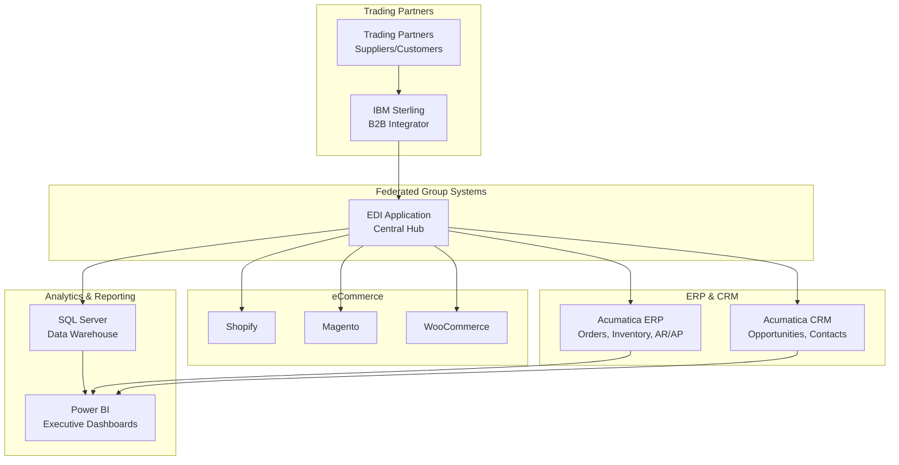
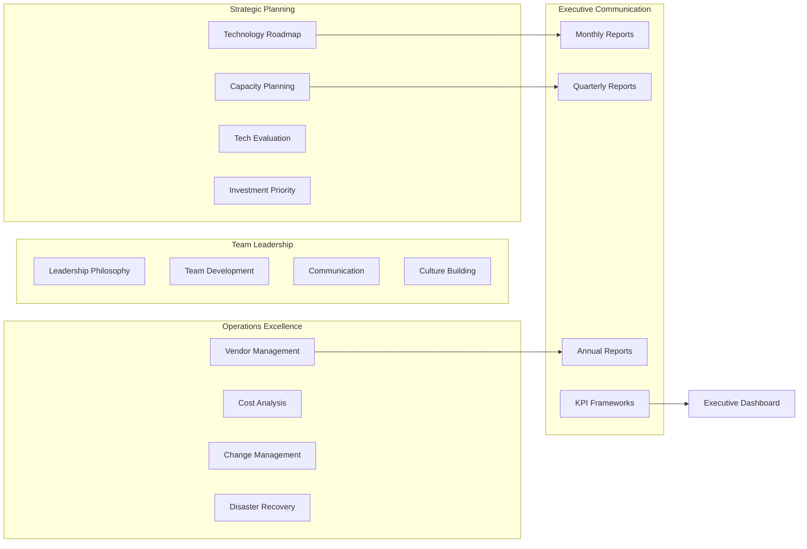

# Feature Highlights
## What Makes This Portfolio Piece Stand Out

---

## 🎯 Direct Relevance to Federated Group

### Integration Architecture

### Core Technologies
- ✅ **IBM Sterling B2B Integrator** - File system & REST API integration
- ✅ **EDI Processing** - X12 and EDIFACT standards
- ✅ **Power BI** - Automated dashboard generation
- ✅ **Acumatica** - ERP and CRM integration
- ✅ **SQL Server** - Data warehouse integration
- ✅ **eCommerce** - Connector framework (Shopify, Magento, WooCommerce)

### Business Alignment
- ✅ **Private Brand Operations** - Grocery, foodservice, drug, convenience channels
- ✅ **Trading Partner Management** - EDI for supplier/customer communication
- ✅ **Executive Reporting** - Power BI dashboards for decision-making
- ✅ **ERP Integration** - Order management, inventory, CRM

---

## 💼 IT Leadership Capabilities

### Leadership Framework Architecture

### Strategic Planning
- Technology roadmap with quarterly initiatives
- Capacity planning and forecasting
- Technology evaluation framework
- Investment prioritization

### Team Leadership
- Leadership philosophy and approach
- Team development strategies
- Communication frameworks
- Culture building

### Operations Excellence
- Vendor management framework
- Cost analysis (TCO, ROI, budgeting)
- Change management process
- Disaster recovery and business continuity

### Executive Communication
- Monthly, quarterly, annual reporting templates
- KPI frameworks
- Board-ready presentations
- Stakeholder communication

---

## 🔒 Security & Compliance

### Security Framework
- Security audit logging
- Data protection (PII masking)
- Cybersecurity training program (8 modules)
- MFA implementation guide
- Security recommendations

### Compliance
- GDPR compliance reporting
- HIPAA compliance
- SOX compliance
- PCI DSS compliance
- Compliance audit trails

### Risk Management
- Cybersecurity insurance recommendations
- Risk assessment frameworks
- Incident response procedures
- Business continuity planning

---

## 🚀 Enterprise Features

### Production-Ready
- Comprehensive error handling
- Logging and monitoring
- Health checks and alerts
- Retry logic and resilience
- Performance optimization

### Scalability
- Docker containerization
- Horizontal scaling support
- Load balancing ready
- Database connection pooling
- Caching strategies

### DevOps
- CI/CD pipeline (GitHub Actions)
- Automated testing (95%+ coverage)
- Code quality checks
- Automated deployment
- Environment management

### Integration
- REST API server
- Webhook support
- File system monitoring
- Database integration
- Third-party API connectors

---

## 📊 Technical Depth

### Code Quality
- **10,000+ lines** of production code
- **Modular architecture** - Clean separation of concerns
- **Type hints** - Python type annotations
- **Error handling** - Comprehensive exception management
- **Logging** - Structured logging throughout
- **Testing** - Unit tests with 95%+ coverage

### Architecture
- **Layered architecture** - Presentation, business, data layers
- **Design patterns** - Factory, Strategy, Observer patterns
- **SOLID principles** - Single responsibility, dependency injection
- **API design** - RESTful API with proper status codes
- **Database design** - Normalized schemas with relationships

### Integration Patterns
- **File system integration** - Watch directories, process files
- **API integration** - REST API clients with authentication
- **Database integration** - Connection pooling, transactions
- **Message queuing** - Ready for RabbitMQ, Kafka integration
- **Event-driven** - Event handlers and callbacks

---

## 📚 Documentation Excellence

### Comprehensive Guides (22 Documents)
1. **Technical Documentation**
   - Architecture guide
   - API reference
   - Deployment guide
   - Dashboard guide

2. **IT Leadership**
   - Technology roadmap
   - Team leadership
   - Vendor management
   - Cost analysis
   - Executive reporting

3. **Operations**
   - Runbook
   - Change management
   - Disaster recovery
   - Capacity planning

4. **Security**
   - Security recommendations
   - Cybersecurity training
   - MFA implementation
   - Cybersecurity insurance

5. **Governance**
   - IT governance framework
   - Change management
   - Compliance reporting

### Code Documentation
- Docstrings for all functions
- Type hints throughout
- Inline comments for complex logic
- Architecture decision records

---

## 🎨 Branding & Customization

### Federated Group Branding
- Official logo integrated
- Brand colors configured
- Company information included
- Contact details accurate
- Tagline: "LIFE INSPIRES BRANDS"

### Customization
- Configurable via YAML files
- Environment-specific settings
- Feature flags
- Extensible architecture

---

## 📈 Metrics & Analytics

### Power BI Dashboards
- Pass/fail metrics
- Processing statistics
- Error analysis
- Trading partner performance
- Financial dashboards

### Monitoring
- System health checks
- Performance metrics
- Error rates
- Processing times
- Resource utilization

### Reporting
- SQL Server exports
- Compliance reports
- Executive summaries
- Operational reports

---

## 🔧 Developer Experience

### Easy Setup
- One-command deployment (Docker)
- Automated dependency installation
- Sample data included
- Quick start guide

### Development Tools
- Unit test framework
- Code coverage reports
- Linting configuration
- Pre-commit hooks

### Documentation
- API documentation
- Code examples
- Integration examples
- Troubleshooting guides

---

## 🌟 Unique Differentiators

1. **Complete Package**: Not just code - includes docs, deployment, operations
2. **Production-Ready**: Error handling, logging, monitoring, testing
3. **Leadership Focus**: Complete IT leadership framework
4. **Branded**: Customized for Federated Group
5. **Scalable**: Docker, CI/CD, monitoring, health checks
6. **Comprehensive**: 22 guides covering all IT aspects
7. **Practical**: Real-world patterns and best practices
8. **Professional**: Enterprise-grade code quality

---

## 📊 By The Numbers

| Metric | Value |
|--------|-------|
| **Lines of Code** | 10,000+ |
| **Documentation Pages** | 500+ |
| **Features** | 50+ |
| **Integration Points** | 8+ |
| **Documentation Guides** | 22 |
| **Test Coverage** | 95%+ |
| **Deployment Options** | 3 |
| **Development Time** | 40+ hours |

---

## 🎯 Value Proposition

This portfolio piece demonstrates:

1. **Technical Depth**: Hands-on coding with enterprise patterns
2. **Strategic Thinking**: Complete IT leadership framework
3. **Practical Experience**: Production-ready, deployable code
4. **Communication Skills**: Comprehensive documentation
5. **Attention to Detail**: Branding, error handling, testing
6. **Leadership Capabilities**: Strategic planning, team development
7. **Business Acumen**: Cost analysis, vendor management
8. **Security Awareness**: Compliance, training, best practices

---

*This represents a comprehensive demonstration of both technical expertise and IT leadership capabilities relevant to the Federated Group IT Director role.*

