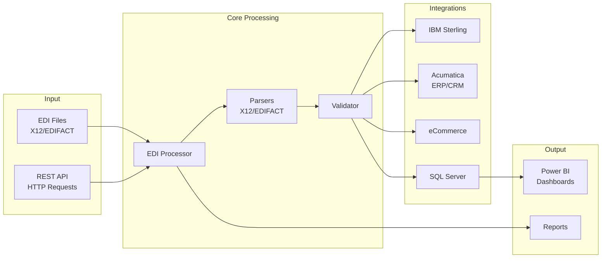

# Sterling-Style EDI Processing POC (Portfolio)

A lightweight Python proof-of-concept demonstrating EDI processing patterns relevant to IBM Sterling B2B Integrator environments, including parsing, validation, exception handling, and metrics.

> **Portfolio / Learning Project** - This repository was created to demonstrate how I ramp on EDI concepts and the operating model behind reliable trading-partner flows. It is not production-ready and not a replacement for IBM Sterling B2B Integrator.

> **Non-Affiliation** - This project is independent and is not affiliated with, endorsed by, or created at the request of any company, including Federated Group or IBM. See [DISCLAIMER.md](DISCLAIMER.md) for full details.

> **Operating Model Focus** - This POC models Sterling-style orchestration and operating-model concepts; in a real environment I would leverage Sterling and/or an established EDI provider for production mappings and partner certifications.

## 🚀 Quick Start for Reviewers

**New to this package?** Start here:
1. **5-Minute Overview**: Read `EXECUTIVE_SUMMARY.md`
2. **Quick Test**: Follow `QUICK_START.md` 
3. **Deep Dive**: Review `REVIEWER_GUIDE.md` for evaluation guidance

**For Technical Evaluators**: See `REVIEWER_GUIDE.md` for code review checklist  
**For Leadership Evaluators**: See `EXECUTIVE_SUMMARY.md` for strategic capabilities overview

## Quick Architecture Overview



## Capability Tiers

### Tier 1 – Implemented for Demo
- **X12 Parsing**: 850/855/856/810 transaction parsing and data extraction
- **Validation**: Syntax and business rule validation with detailed error reporting
- **Exception Handling**: Error handling patterns and retry logic
- **Metrics Collection**: Processing metrics and performance tracking
- **Power BI Dashboards**: Automated dashboard generation for metrics visualization
- **File Monitoring**: Directory monitoring patterns for file processing

### Tier 2 – Stubbed/Illustrative
- **Sterling API Integration**: REST API client patterns (illustrative, not production-certified)
- **Acumatica Sync**: ERP/CRM integration patterns (demonstration only)
- **SQL Server Integration**: Data warehouse export patterns
- **Security Audit**: Audit logging and compliance reporting patterns

### Tier 3 – Future/Roadmap
- **EDIFACT Transformation**: Full X12 ↔ EDIFACT conversion
- **AI-Assisted Validations**: Machine learning validation patterns
- **eCommerce Adapters**: Production-ready Shopify/Magento/WooCommerce connectors
- **Advanced Monitoring**: Production-grade alerting and SLA tracking

## Operating Model Focus

This POC demonstrates key operating model concepts for reliable EDI flows:

- **Trading Partner Onboarding**: Checklist and validation patterns
- **Test Harness**: Automated testing for EDI transactions
- **Exception Ownership**: Error handling, retry logic, and SLA patterns
- **Master Data Dependencies**: Data validation and relationship awareness
- **Monitoring KPIs**: Failure rate tracking, time-to-reprocess metrics, partner readiness indicators
- **Reliability Patterns**: Logging, monitoring, and operational visibility

## Features

- **Multi-Standard Support**: Handles both X12 and EDIFACT EDI formats (Tier 1: X12 fully implemented, EDIFACT parsing demonstrated)
- **Validation Patterns**: Syntax and business rule validation with detailed error reporting
- **Format Transformation**: Convert between X12 and EDIFACT formats (illustrative patterns)
- **Sterling-Style Integration**: File system and API integration patterns modeled after IBM Sterling B2B Integrator
- **File Monitoring**: Automatic monitoring patterns for pickup directories
- **Demonstration Patterns**: Logging, error handling, retry logic, and monitoring capabilities (POC-level, not production-ready)
- **Extensible Architecture**: Easy to add new transaction types and validation rules

## Supported Transaction Types

### X12
- **850**: Purchase Order
- **855**: Purchase Order Acknowledgment
- **810**: Invoice
- **856**: Ship Notice/Manifest

### EDIFACT
- **ORDERS**: Purchase Order
- **DESADV**: Despatch Advice
- **INVOIC**: Invoice

## Deployment Options

### Docker Deployment (Recommended)

```bash
# Build and run with Docker Compose
docker-compose up -d

# Check status
docker-compose ps

# View logs
docker-compose logs -f

# Stop
docker-compose down
```

The API will be available at `http://localhost:5000`

### Standalone Deployment

See [DEPLOYMENT.md](docs/DEPLOYMENT.md) for detailed instructions.

### REST API

The application includes a REST API server. See [API_REFERENCE_REST.md](docs/API_REFERENCE_REST.md) for complete documentation.

```bash
# Start API server
python -m src.api_server

# Or with Docker
docker-compose up
```

## Quick Start

### Prerequisites

- Python 3.8 or higher
- IBM Sterling B2B Integrator (for integration features)

### Installation

1. Extract the application package:
```bash
unzip sterling_edi_app.zip
cd sterling_edi_app
```

2. Install dependencies:
```bash
pip install -r requirements.txt
```

3. Configure the application:
   - Edit `config/config.yaml` for general settings
   - Edit `config/sterling_config.yaml` for Sterling-specific settings

### Basic Usage

#### Process a single file:
```bash
python main.py process --file path/to/edi/file.x12
```

#### Process all files in a directory:
```bash
python main.py process --directory path/to/edi/directory
```

#### Validate an EDI file:
```bash
python main.py validate --file path/to/edi/file.x12
```

#### Monitor directories for new files:
```bash
python main.py monitor
```

#### Generate Power BI dashboard:
```bash
# Generate dashboard with sample data (for testing)
python main.py dashboard --generate-sample-metrics

# Generate dashboard with real processing metrics
python main.py dashboard
```

#### Generate Financial Dashboards:
```bash
# Generate all financial dashboards (P&L, Sales, Inventory, AR/AP)
python main.py financial-dashboards
```

## Configuration

### Application Configuration (`config/config.yaml`)

Key settings:
- `processing.validate`: Enable/disable validation
- `processing.deliver`: Enable/disable automatic delivery to Sterling
- `monitoring.enabled`: Enable file monitoring
- `monitoring.watch_directories`: Directories to monitor

### Sterling Configuration (`config/sterling_config.yaml`)

Key settings:
- `file_system.pickup_directories`: Sterling pickup directories
- `file_system.delivery_directories`: Sterling delivery directories
- `api.base_url`: Sterling API base URL (if using API integration)
- `api.username` / `api.password`: API credentials

See the configuration files for detailed options and comments.

## Architecture

The application consists of the following main components:

- **EDI Processor**: Main orchestrator for processing pipeline
- **X12 Parser**: Parses X12 EDI files
- **EDIFACT Parser**: Parses EDIFACT EDI files
- **EDI Validator**: Validates EDI syntax and business rules
- **EDI Transformer**: Converts between formats and applies mappings
- **File Monitor**: Monitors directories for new files
- **Sterling Integration**: File system and API integration

## Project Structure

```
sterling_edi_app/
├── README.md                 # This file
├── requirements.txt          # Python dependencies
├── main.py                   # Application entry point
├── config/                   # Configuration files
│   ├── config.yaml
│   └── sterling_config.yaml
├── src/                      # Source code
│   ├── edi_processor.py
│   ├── x12_parser.py
│   ├── edifact_parser.py
│   ├── edi_validator.py
│   ├── edi_transformer.py
│   ├── file_monitor.py
│   ├── sterling_integration.py
│   ├── acumatica_connector.py  # Acumatica ERP & CRM connector
│   ├── acumatica_crm_integration.py  # CRM-specific integration layer
│   ├── ecommerce_connector.py  # eCommerce platform connector
│   ├── ai_automation.py  # AI validation and automation
│   ├── sql_server_integration.py  # SQL Server database integration
│   ├── metrics_collector.py  # Metrics tracking
│   ├── powerbi_dashboard.py  # Power BI dashboard generator
│   ├── powerbi_financial_dashboards.py  # Financial dashboards generator
│   ├── generate_sample_metrics.py  # Sample data generator
│   └── utils/
├── tests/                    # Unit tests
│   ├── test_x12_parser.py
│   ├── test_edifact_parser.py
│   ├── test_validator.py
│   └── sample_data/
└── docs/                     # Documentation
    ├── DEPLOYMENT.md
    ├── ARCHITECTURE.md
    └── API_REFERENCE.md
```

## Acumatica ERP & CRM Integration

The application includes a comprehensive Acumatica ERP and CRM connector:

### ERP Functionality
- **REST API Integration**: Full Acumatica REST API client
- **EDI Transaction Sync**: Automatically sync EDI 850 (PO) and 810 (Invoice) to Acumatica
- **Sales Orders**: Create and manage sales orders
- **Purchase Orders**: Create and manage purchase orders
- **Inventory Management**: Query inventory items and quantities
- **Customer/Vendor Management**: Access customer and vendor data
- **Financial Transactions**: Query AR/AP transactions

### CRM Functionality (Acumatica Built-in CRM)
- **Contacts**: Create, read, and manage contacts
- **Opportunities**: Full opportunity lifecycle management (create, update, pipeline tracking)
- **Activities**: Log calls, meetings, tasks, and EDI processing activities
- **Cases**: Create and manage support cases
- **Leads**: Lead management with conversion to opportunities
- **Accounts**: Account management with 360-degree view
- **Sales Pipeline**: Pipeline summary and analytics
- **Account 360 View**: Combined CRM + ERP data for comprehensive account insights

### CRM Integration Features
- **EDI-to-CRM Sync**: Automatically sync EDI customer data to CRM contacts/accounts
- **Opportunity Creation**: Create CRM opportunities from EDI 850 Purchase Orders
- **Activity Logging**: Automatically log EDI processing as CRM activities
- **Account 360 View**: Get complete account view combining CRM and ERP data

### Configuration

Edit `config/acumatica_config.yaml`:
```yaml
acumatica:
  enabled: true
  base_url: "https://your-acumatica-instance.com"
  username: "your_username"
  password: "your_password"
  auto_sync: true  # Auto-sync EDI transactions
```

## Power BI Dashboards

### EDI Processing Dashboard

The application includes a Power BI dashboard generator that creates comprehensive visualizations of EDI processing metrics:

- **Pass/Fail Metrics**: Success rates, failure analysis
- **Transaction Analytics**: Breakdown by transaction type (850, 855, 810, etc.)
- **Time Series**: Processing trends over time
- **Error Analysis**: Detailed error categorization and trends
- **Trading Partner Performance**: Statistics per trading partner

### Generating the Dashboard

1. Process some EDI files (or generate sample metrics):
```bash
python main.py dashboard --generate-sample-metrics
```

2. Generate the Power BI dashboard:
```bash
python main.py dashboard
```

3. Open in Power BI Desktop:
   - Open Power BI Desktop
   - File > Open > Browse
   - Navigate to `dashboards/EDIProcessingDashboard.pbip`
   - The dashboard will load with your metrics

### Financial Dashboards

The application also generates multiple financial-focused Power BI dashboards:

- **Financial Metrics Dashboard**: P&L analysis, budget variance, cash flow
- **Sales Analytics Dashboard**: Revenue trends, customer analysis, product performance
- **Inventory & Operations Dashboard**: Stock levels, turnover, supplier metrics
- **AR/AP Dashboard**: Accounts receivable/payable aging, payment trends

Generate all financial dashboards:
```bash
python main.py financial-dashboards
```

Dashboards are created in `dashboards/` directory and can be opened in Power BI Desktop.

## Testing

Run unit tests:
```bash
python -m pytest tests/
```

Or run specific test:
```bash
python -m pytest tests/test_x12_parser.py
```

## Logging

Logs are written to the `logs/` directory with automatic rotation. Log level can be configured in `config/config.yaml`.

## Error Handling

- Failed files are moved to an `error/` directory
- Successfully processed files are moved to a `processed/` directory
- Detailed error messages are logged and included in processing results

## Deployment

For detailed deployment instructions, see [DEPLOYMENT.md](docs/DEPLOYMENT.md).

## License

This application is provided as-is for demonstration and portfolio purposes.

## Power BI Dashboard

The application includes automated Power BI dashboard generation. See [docs/DASHBOARD.md](docs/DASHBOARD.md) for detailed instructions.

Quick start:
```bash
# Generate dashboard with sample data
python main.py dashboard --generate-sample-metrics

# Generate dashboard with real metrics
python main.py dashboard
```

## Support

For questions or issues, refer to the deployment documentation or review the code comments for implementation details.

