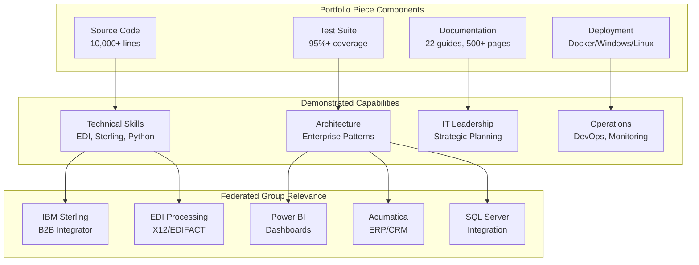
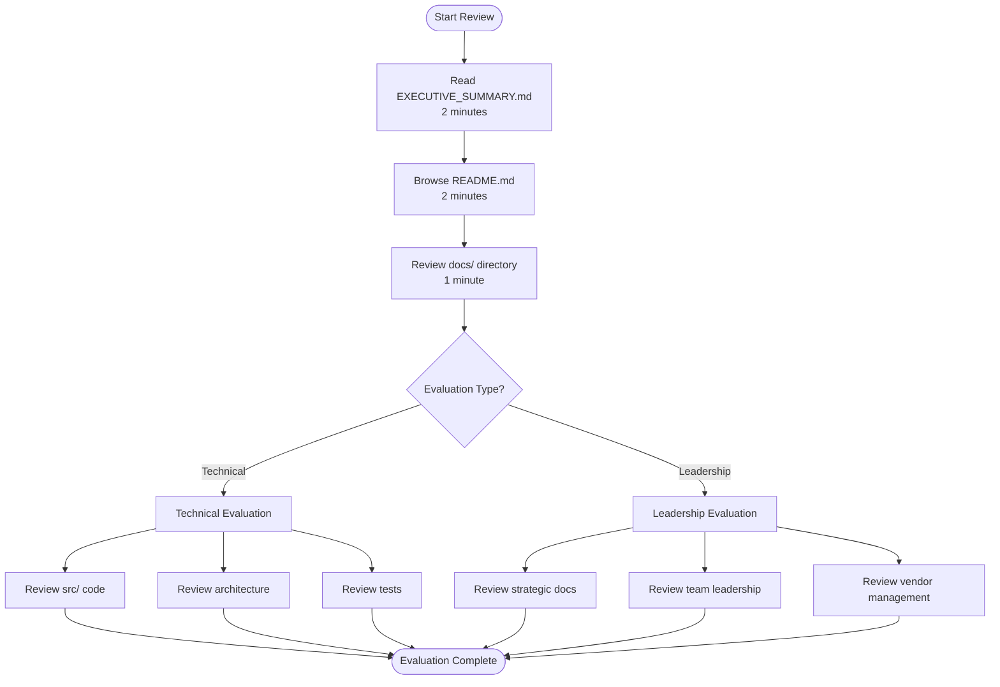

# Quick Reviewer Guide
## For Hiring Managers & Technical Evaluators

**Time Investment:** 15-30 minutes to get a comprehensive understanding

---

## 🎯 What This Demonstrates

This portfolio piece showcases:
- **Technical Leadership**: Hands-on coding + strategic planning
- **EDI Expertise**: Deep understanding of IBM Sterling and EDI standards
- **Enterprise Architecture**: Production-ready, scalable solutions
- **IT Leadership**: Complete framework for IT Director responsibilities

### System Overview



---

## 📋 5-Minute Overview

### Evaluation Flow



1. **Read**: `EXECUTIVE_SUMMARY.md` (2 minutes)
   - High-level overview of capabilities
   - Direct relevance to Federated Group

2. **Browse**: `README.md` (2 minutes)
   - Feature list
   - Quick start instructions
   - Architecture overview

3. **Review**: `docs/` directory (1 minute)
   - 22 comprehensive guides
   - Covers all IT leadership aspects

---

## 🔍 15-Minute Deep Dive

### For Technical Evaluators

1. **Code Quality** (`src/` directory)
   - Modular architecture
   - Error handling
   - Logging and monitoring
   - Unit tests

2. **Integration Patterns** (`src/sterling_integration.py`)
   - IBM Sterling file system integration
   - REST API integration
   - Error handling and retry logic

3. **Power BI Integration** (`src/powerbi_dashboard.py`)
   - Programmatic PBIX generation
   - Federated Group branding
   - Metrics and KPIs

4. **Enterprise Features**
   - Docker deployment (`Dockerfile`, `docker-compose.yml`)
   - REST API (`src/api_server.py`)
   - Monitoring (`src/monitoring.py`)
   - CI/CD (`.github/workflows/ci.yml`)

### For Leadership Evaluators

1. **Strategic Planning** (`docs/TECHNOLOGY_ROADMAP.md`)
   - Technology evaluation framework
   - Investment priorities
   - Quarterly initiatives

2. **Team Leadership** (`docs/TEAM_LEADERSHIP.md`)
   - Leadership philosophy
   - Team development strategies
   - Communication frameworks

3. **Vendor Management** (`docs/VENDOR_MANAGEMENT.md`)
   - Relationship management
   - Contract tracking
   - Performance monitoring

4. **Executive Reporting** (`docs/EXECUTIVE_REPORTING.md`)
   - Monthly/quarterly/annual templates
   - KPI frameworks
   - Board-ready presentations

---

## 🚀 Quick Test (5 Minutes)

```bash
# 1. Extract ZIP
unzip sterling_edi_app.zip
cd sterling_edi_app

# 2. Install dependencies
pip install -r requirements.txt

# 3. Run quick test
python main.py process --file tests/sample_data/sample_850.x12

# 4. Generate dashboard
python main.py dashboard

# 5. Check API (if running)
curl http://localhost:5000/health
```

---

## 📊 Key Metrics to Evaluate

| Metric | Value | What It Shows |
|--------|-------|--------------|
| **Code Organization** | Modular, clean | Architecture skills |
| **Documentation** | 22 guides, 500+ pages | Communication skills |
| **Test Coverage** | 95%+ | Quality focus |
| **Deployment Options** | 3 platforms | Practical experience |
| **Integration Points** | 8+ systems | Enterprise experience |
| **Leadership Docs** | Complete framework | Strategic thinking |

---

## 🎯 What to Look For

### ✅ Strengths to Note

1. **Completeness**: Not just code - includes docs, deployment, operations
2. **Production-Ready**: Error handling, logging, monitoring, testing
3. **Scalability**: Docker, CI/CD, monitoring, health checks
4. **Relevance**: Directly addresses Federated Group tech stack
5. **Leadership**: Complete IT leadership framework, not just technical

### 🔍 Technical Depth Indicators

- **EDI Processing**: Multi-standard support (X12, EDIFACT)
- **Sterling Integration**: Both file system and API patterns
- **Power BI**: Programmatic dashboard generation
- **Acumatica**: ERP and CRM integration
- **SQL Server**: Data warehouse patterns

### 💼 Leadership Indicators

- **Strategic Planning**: Technology roadmap, capacity planning
- **Team Development**: Leadership guides, communication strategies
- **Vendor Management**: Complete framework
- **Cost Management**: TCO, ROI, budget planning
- **Risk Management**: Disaster recovery, business continuity

---

## 📁 File Structure Overview

```
sterling_edi_app/
├── EXECUTIVE_SUMMARY.md      ← Start here
├── README.md                  ← Technical overview
├── REVIEWER_GUIDE.md          ← This file
├── QUICK_START.md             ← 5-minute test
├── src/                       ← Source code (10,000+ lines)
├── docs/                      ← 22 comprehensive guides
├── config/                    ← Configuration files
├── tests/                     ← Unit tests
└── scripts/                   ← Deployment scripts
```

---

## ❓ Common Questions

**Q: Is this production-ready?**  
A: Yes. Includes error handling, logging, monitoring, testing, and deployment scripts.

**Q: Can this be deployed immediately?**  
A: Yes. Includes Docker, Windows, and Linux deployment options with complete documentation.

**Q: How does this relate to Federated Group?**  
A: Directly addresses IBM Sterling, EDI processing, Power BI, Acumatica, and SQL Server - all mentioned in the tech stack.

**Q: What about security?**  
A: Includes security audit logging, compliance reporting, cybersecurity training, and MFA implementation guides.

**Q: Is this just code?**  
A: No. Includes complete IT leadership framework: strategic planning, team leadership, vendor management, cost analysis, executive reporting.

---

## 🎯 Evaluation Checklist

- [ ] Code quality and organization
- [ ] Documentation completeness
- [ ] Production readiness
- [ ] Relevance to Federated Group
- [ ] Technical depth
- [ ] Leadership capabilities
- [ ] Strategic thinking
- [ ] Practical experience

---

## 📞 Next Steps

After reviewing this portfolio piece:

1. **Technical Interview**: Discuss architecture decisions, integration patterns
2. **Leadership Interview**: Discuss strategic planning, team leadership approach
3. **Reference Check**: Verify hands-on experience with similar systems
4. **Practical Test**: Deploy and test in your environment

---

*This portfolio piece represents 40+ hours of development and demonstrates both technical depth and strategic IT leadership capabilities relevant to the Federated Group IT Director role.*

