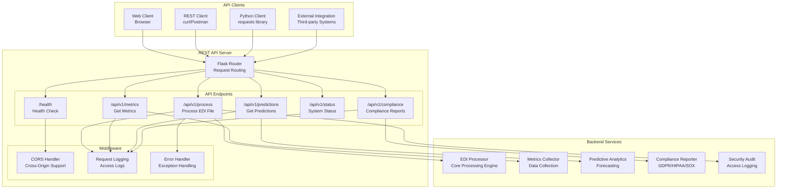
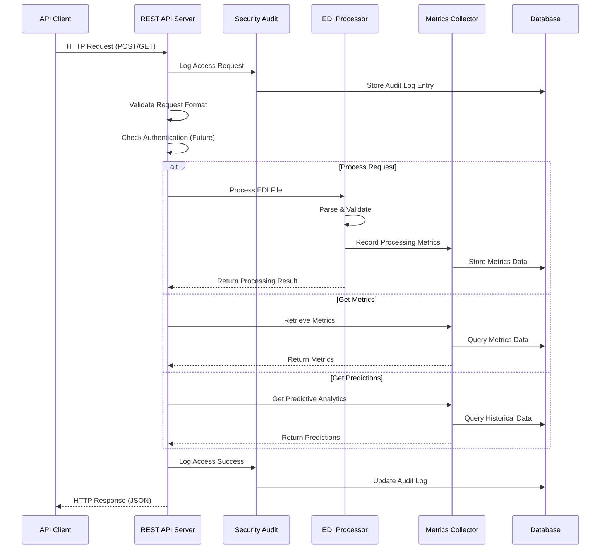

# REST API Reference

The EDI application provides a REST API for programmatic access to EDI processing and system management.

## API Architecture



### Request/Response Flow



## Base URL

```
http://localhost:5000/api/v1
```

## Authentication

Currently, the API uses IP-based access logging. For production, implement proper authentication (API keys, OAuth, etc.).

## Endpoints

### Health Check

**GET** `/health`

Check if the API server is running.

**Response:**
```json
{
  "status": "healthy",
  "service": "EDI Processor API",
  "version": "1.4.0"
}
```

### Process EDI File

**POST** `/api/v1/process`

Process an EDI file.

**Request Body:**
```json
{
  "filepath": "/path/to/edi/file.x12"
}
```

**Response:**
```json
{
  "filepath": "/path/to/edi/file.x12",
  "success": true,
  "edi_type": "X12",
  "data": {
    "transaction_type": "850",
    "po_number": "PO12345"
  },
  "processing_time_ms": 250
}
```

### Get Metrics

**GET** `/api/v1/metrics`

Get processing metrics.

**Query Parameters:**
- `start_date` (optional): Start date filter (YYYY-MM-DD)
- `end_date` (optional): End date filter (YYYY-MM-DD)

**Response:**
```json
{
  "total_processed": 1000,
  "success_count": 950,
  "failed_count": 50,
  "success_rate": 0.95,
  "error_rate": 0.05
}
```

### Get Predictions

**GET** `/api/v1/predictions`

Get predictive analytics.

**Query Parameters:**
- `transaction_type` (optional): Filter by transaction type
- `days_ahead` (optional): Days to predict ahead (default: 7)

**Response:**
```json
{
  "transaction_type": "850",
  "predicted_processing_time": 2.5,
  "confidence_interval": 0.3,
  "volume_prediction": {
    "predicted_volume": 150,
    "trend": 0.05,
    "confidence": "medium"
  }
}
```

### Get System Status

**GET** `/api/v1/status`

Get system status and health.

**Response:**
```json
{
  "service": "EDI Processor",
  "status": "operational",
  "metrics": {
    "total_processed": 1000,
    "success_rate": 0.95,
    "error_rate": 0.05
  },
  "insights": [
    "Consider optimizing 850 processing"
  ]
}
```

### Compliance Reports

**GET** `/api/v1/compliance/access-report`

Get access report for compliance.

**Query Parameters:**
- `start_date` (optional): Start date (default: 2025-01-01)
- `end_date` (optional): End date (default: 2025-12-31)

**GET** `/api/v1/compliance/data-access-report`

Get data access report for compliance.

**Query Parameters:**
- `start_date` (optional): Start date (default: 2025-01-01)
- `end_date` (optional): End date (default: 2025-12-31)

## Error Responses

All endpoints return standard HTTP status codes:

- `200 OK`: Request successful
- `400 Bad Request`: Invalid request parameters
- `500 Internal Server Error`: Server error

Error response format:
```json
{
  "error": "Error message description"
}
```

## Running the API Server

### Standalone

```bash
python -m src.api_server
```

### Docker

```bash
docker-compose up
```

The API will be available at `http://localhost:5000`

## Example Usage

### Using curl

```bash
# Health check
curl http://localhost:5000/health

# Process file
curl -X POST http://localhost:5000/api/v1/process \
  -H "Content-Type: application/json" \
  -d '{"filepath": "tests/sample_data/sample_850.x12"}'

# Get metrics
curl http://localhost:5000/api/v1/metrics?start_date=2025-01-01&end_date=2025-12-31
```

### Using Python

```python
import requests

# Process file
response = requests.post('http://localhost:5000/api/v1/process', 
                        json={'filepath': 'tests/sample_data/sample_850.x12'})
result = response.json()

# Get metrics
response = requests.get('http://localhost:5000/api/v1/metrics')
metrics = response.json()
```

