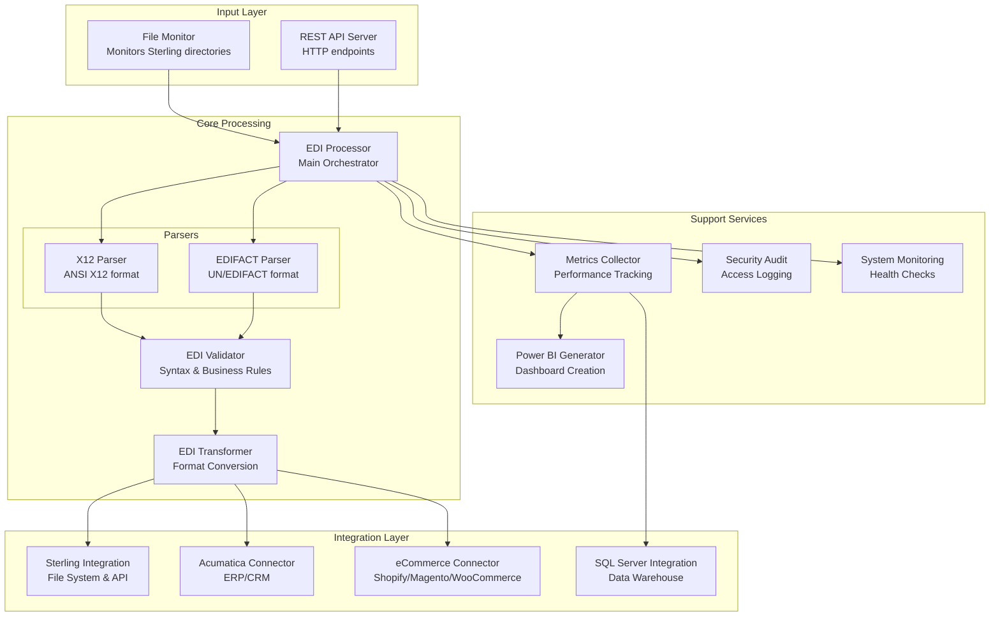
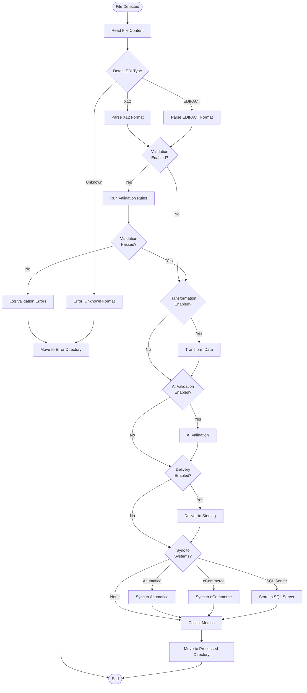
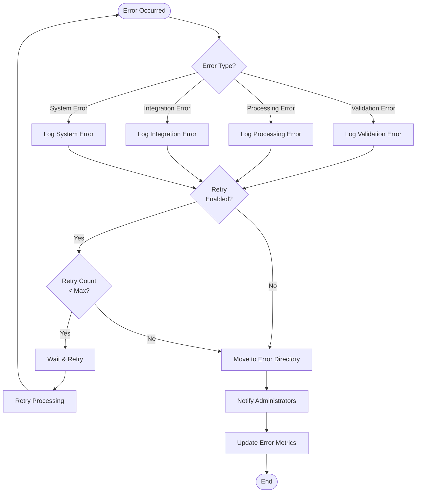
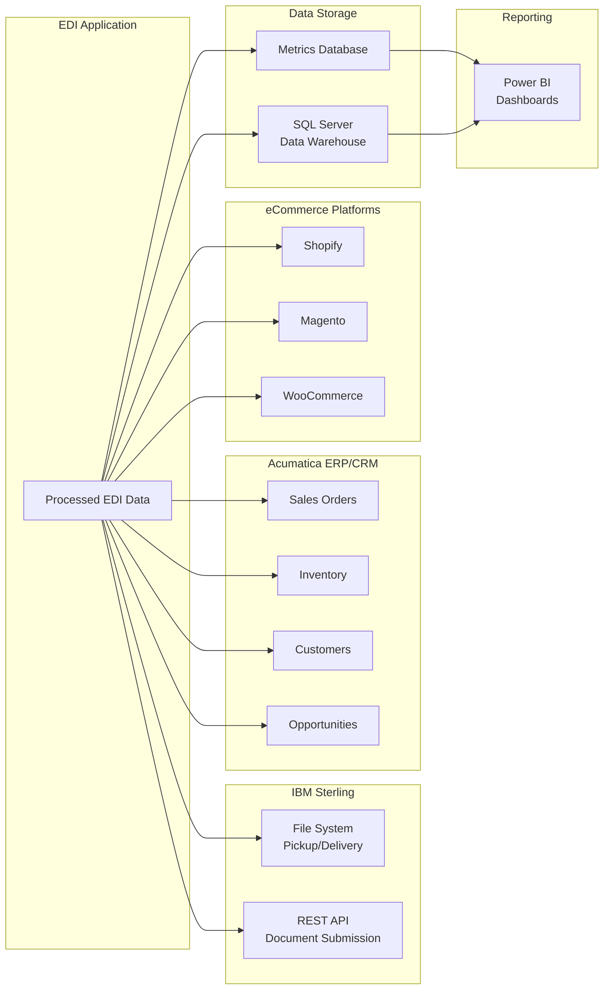
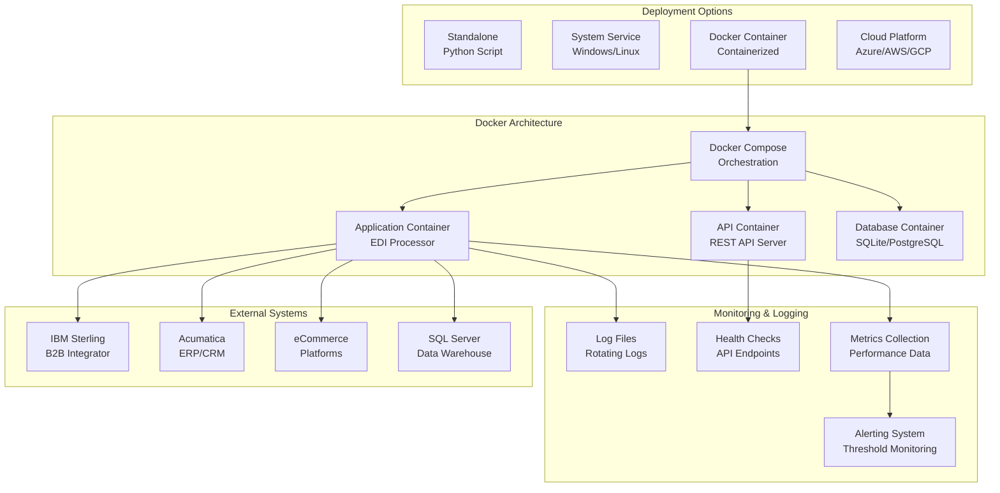

# IBM Sterling EDI Application - Architecture

## Overview

The IBM Sterling EDI Application is designed as a modular, extensible system for processing EDI files in IBM Sterling B2B Integrator environments. The architecture follows a pipeline pattern where files flow through distinct processing stages.

## System Architecture

## Component Details

### 1. File Monitor

**Purpose**: Monitors directories for new EDI files

**Implementation**:
- Uses `watchdog` library for efficient file system monitoring
- Falls back to polling if `watchdog` is unavailable
- Handles file locking and stability checks

**Key Features**:
- Multiple directory monitoring
- Recursive directory scanning
- File extension filtering
- File stability detection

### 2. EDI Processor

**Purpose**: Main orchestrator for the processing pipeline

**Responsibilities**:
- File type detection (X12 vs EDIFACT)
- Routing to appropriate parser
- Coordinating validation and transformation
- Managing delivery to Sterling
- Error handling and file movement

### 3. X12 Parser

**Purpose**: Parse X12 EDI files

**Capabilities**:
- Automatic separator detection
- Envelope parsing (ISA/IEA, GS/GE, ST/SE)
- Transaction extraction
- Data extraction for common transaction types (850, 855, 810, 856)

**Data Structures**:
- `X12Envelope`: Interchange-level structure
- `X12Transaction`: Transaction set structure
- `X12Segment`: Individual segment structure

### 4. EDIFACT Parser

**Purpose**: Parse EDIFACT EDI files

**Capabilities**:
- UNA segment detection (service string advice)
- Envelope parsing (UNB/UNZ, UNH/UNT)
- Message extraction
- Data extraction for common message types (ORDERS, DESADV, INVOIC)

**Data Structures**:
- `EdifactEnvelope`: Interchange-level structure
- `EdifactMessage`: Message structure
- `EdifactSegment`: Individual segment structure

### 5. EDI Validator

**Purpose**: Validate EDI files for syntax and business rules

**Validation Levels**:
- **Syntax Validation**: Segment structure, element counts, required fields
- **Business Rule Validation**: Transaction-specific rules, code values

**Output**:
- Detailed error reports
- Warning messages
- Validation summary

### 6. EDI Transformer

**Purpose**: Transform EDI data between formats and apply mappings

**Capabilities**:
- X12 ↔ EDIFACT conversion
- Data mapping and transformation
- Field enrichment
- Custom transformation rules

### 7. Sterling Integration

**Purpose**: Integrate with IBM Sterling B2B Integrator

**Integration Methods**:

#### File System Integration
- Reads from Sterling pickup directories
- Writes to Sterling delivery directories
- Handles file naming conventions
- Manages processed/error directories

#### API Integration
- REST API client for Sterling B2B Integrator
- Document submission
- Status queries
- Trading partner configuration retrieval

## Data Flow

### Processing Pipeline

### Error Handling Flow

### Integration Data Flow

## Configuration Management

### Configuration Files

1. **config.yaml**: Application-level settings
   - Processing options
   - Monitoring settings
   - Validation rules
   - Performance tuning

2. **sterling_config.yaml**: Sterling-specific settings
   - Directory paths
   - API configuration
   - Trading partner settings
   - File naming conventions

### Configuration Loading

- YAML-based configuration
- Environment variable support (for sensitive data)
- Configuration merging (base + Sterling)
- Runtime configuration updates

## Logging

### Log Structure

- **Location**: `logs/` directory
- **Format**: Rotating log files with date stamps
- **Rotation**: 10MB per file, 5 backups
- **Levels**: DEBUG, INFO, WARNING, ERROR

### Log Categories

- File operations
- Processing results
- Validation errors
- API calls
- System events

## Extensibility

### Adding New Transaction Types

1. Extend parser with new extraction method
2. Add validation rules
3. Update transformer mappings
4. Add sample data

### Adding New Validations

1. Create validation method in `EDIValidator`
2. Add to validation pipeline
3. Configure in validation rules

### Custom Transformations

1. Define mapping configuration
2. Implement transformation logic
3. Configure in transformation settings

## Performance Considerations

### Optimization Strategies

- **Parallel Processing**: Multiple files processed concurrently
- **Batch Processing**: Group files for efficient processing
- **Caching**: Cache parsed structures for repeated access
- **Lazy Loading**: Load data only when needed

### Scalability

- Stateless processing (can run multiple instances)
- File-based integration (no shared state)
- Horizontal scaling support
- Resource-efficient design

## Security

### Security Features

- Secure credential storage (environment variables)
- File permission management
- API authentication
- Log sanitization (no sensitive data)

### Best Practices

- Run with minimal required permissions
- Use service accounts
- Encrypt sensitive configuration
- Regular security updates

## Testing

### Test Structure

- **Unit Tests**: Individual component testing
- **Integration Tests**: End-to-end processing
- **Sample Data**: Realistic EDI files for testing

### Test Coverage

- Parser functionality
- Validation rules
- Transformation logic
- Error handling

## Deployment Architecture

### Deployment Options

1. **Standalone**: Run as Python script
2. **Service**: Install as system service
3. **Container**: Docker container deployment
4. **Cloud**: Cloud platform deployment

### Monitoring

- Log file monitoring
- Process status checks
- File processing metrics
- Error rate tracking

