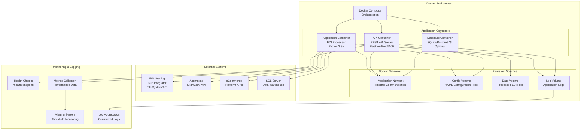
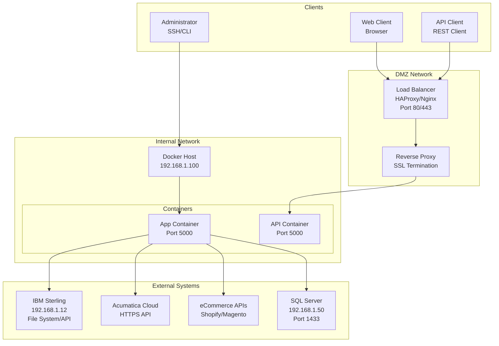
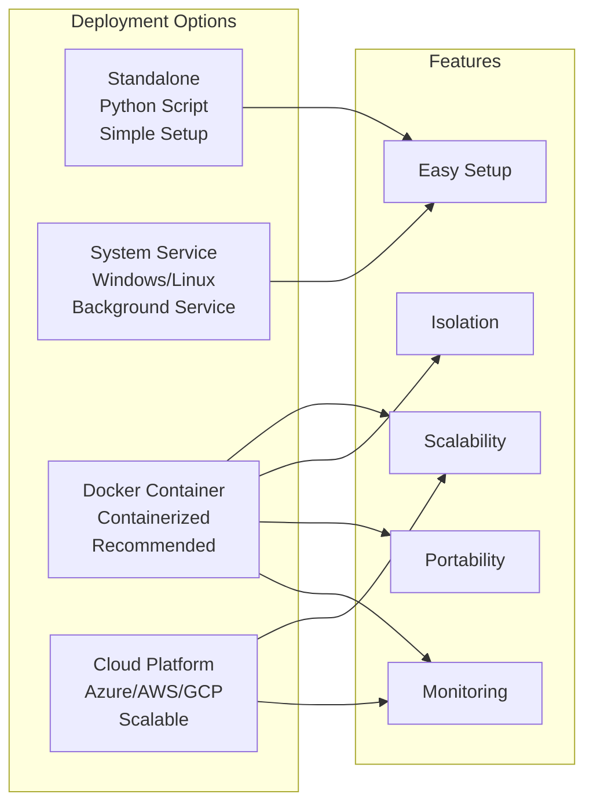

# IBM Sterling EDI Application - Deployment Guide

This guide provides detailed step-by-step instructions for deploying the IBM Sterling EDI Application in an IBM Sterling B2B Integrator environment.

## Deployment Architecture

### Docker Deployment Architecture



### Network Topology



### Deployment Options Comparison



## Table of Contents

1. [Prerequisites](#prerequisites)
2. [Installation](#installation)
3. [Configuration](#configuration)
4. [Sterling B2B Integrator Setup](#sterling-b2b-integrator-setup)
5. [Testing](#testing)
6. [Production Deployment](#production-deployment)
7. [Troubleshooting](#troubleshooting)

## Prerequisites

### System Requirements

- **Operating System**: Windows Server 2016+ or Linux (RHEL 7+, Ubuntu 18.04+)
- **Python**: Version 3.8 or higher
- **Memory**: Minimum 2GB RAM (4GB+ recommended)
- **Disk Space**: 500MB for application + space for logs and processed files
- **Network**: Access to IBM Sterling B2B Integrator server

### Software Dependencies

- Python 3.8+
- pip (Python package manager)
- IBM Sterling B2B Integrator (for integration)

### Access Requirements

- Read/write access to Sterling pickup and delivery directories
- Network access to Sterling API (if using API integration)
- Appropriate file system permissions

## Installation

### Step 1: Extract Application Package

Extract the `sterling_edi_app.zip` file to your desired location:

**Windows:**
```powershell
Expand-Archive -Path sterling_edi_app.zip -DestinationPath C:\EDI\sterling_edi_app
cd C:\EDI\sterling_edi_app
```

**Linux/Unix:**
```bash
unzip sterling_edi_app.zip -d /opt/edi/
cd /opt/edi/sterling_edi_app
```

### Step 2: Verify Python Installation

Check Python version:
```bash
python --version
# Should show Python 3.8 or higher
```

If Python is not installed, download from [python.org](https://www.python.org/downloads/).

### Step 3: Install Python Dependencies

**Windows:**
```powershell
python -m pip install --upgrade pip
pip install -r requirements.txt
```

**Linux/Unix:**
```bash
python3 -m pip install --upgrade pip
pip3 install -r requirements.txt
```

### Step 4: Verify Installation

Test that all modules can be imported:
```bash
python -c "import yaml; import requests; print('Dependencies OK')"
```

## Configuration

### Step 1: Configure Application Settings

Edit `config/config.yaml`:

```yaml
app:
  log_level: "INFO"  # Set to DEBUG for troubleshooting

processing:
  validate: true      # Enable validation
  deliver: true      # Enable delivery to Sterling

monitoring:
  enabled: true      # Enable file monitoring
```

### Step 2: Configure Sterling Integration

Edit `config/sterling_config.yaml`:

#### File System Configuration

Update the pickup and delivery directories to match your Sterling environment:

```yaml
file_system:
  pickup_directories:
    - "C:/Sterling/pickup"           # Windows
    # - "/opt/sterling/pickup"       # Linux
  
  delivery_directories:
    - "C:/Sterling/delivery"         # Windows
    # - "/opt/sterling/delivery"     # Linux
```

**Important**: Use the exact paths configured in your Sterling B2B Integrator.

#### API Configuration (Optional)

If using API integration:

```yaml
api:
  enabled: true
  base_url: "https://sterling-server.example.com:9080"
  username: "your_username"
  password: "your_password"
```

**Security Note**: In production, store passwords securely (environment variables, key vault, etc.).

### Step 3: Create Required Directories

The application will create subdirectories automatically, but you can create them manually:

**Windows:**
```powershell
New-Item -ItemType Directory -Path "C:\Sterling\pickup\processed"
New-Item -ItemType Directory -Path "C:\Sterling\pickup\error"
```

**Linux:**
```bash
mkdir -p /opt/sterling/pickup/processed
mkdir -p /opt/sterling/pickup/error
```

## Sterling B2B Integrator Setup

### Step 1: Verify Sterling Directory Structure

Ensure your Sterling B2B Integrator is configured with the following directory structure:

```
Sterling/
├── pickup/          # Incoming EDI files
├── delivery/        # Outgoing EDI files
└── archive/        # Archived files (optional)
```

### Step 2: Configure Sterling Trading Partners

In Sterling B2B Integrator:

1. Navigate to Trading Partner Management
2. Verify trading partner configurations
3. Note the trading partner IDs (used in file naming)

### Step 3: Test File System Access

Verify the application can access Sterling directories:

**Windows:**
```powershell
Test-Path "C:\Sterling\pickup"
Test-Path "C:\Sterling\delivery"
```

**Linux:**
```bash
test -d /opt/sterling/pickup && echo "OK" || echo "Missing"
test -d /opt/sterling/delivery && echo "OK" || echo "Missing"
```

### Step 4: Set File Permissions

Ensure the application has appropriate permissions:

**Windows:**
- Grant "Modify" permissions to the application user account
- Ensure the user can read/write in Sterling directories

**Linux:**
```bash
chmod -R 755 /opt/sterling/pickup
chmod -R 755 /opt/sterling/delivery
chown -R edi_user:edi_group /opt/sterling/pickup
chown -R edi_user:edi_group /opt/sterling/delivery
```

## Testing

### Step 1: Test with Sample Files

Use the provided sample files:

```bash
# Test X12 processing
python main.py process --file tests/sample_data/sample_850.x12

# Test EDIFACT processing
python main.py process --file tests/sample_data/sample_855.edifact

# Test validation
python main.py validate --file tests/sample_data/sample_850.x12
```

### Step 2: Test File Monitoring

1. Start the monitor:
```bash
python main.py monitor
```

2. Copy a test file to the pickup directory
3. Verify the file is processed and moved to processed/ directory

### Step 3: Test Sterling Integration

1. Place a test EDI file in the Sterling pickup directory
2. Run the processor:
```bash
python main.py process --directory C:/Sterling/pickup
```

3. Verify:
   - File is processed successfully
   - File appears in delivery directory (if deliver is enabled)
   - File is moved to processed/ directory

### Step 4: Run Unit Tests

```bash
python -m pytest tests/ -v
```

## Production Deployment

### Step 1: Create Service Account

Create a dedicated service account for running the application:

**Windows:**
- Create a service account in Active Directory
- Grant appropriate permissions

**Linux:**
```bash
useradd -r -s /bin/false edi_service
```

### Step 2: Install as Windows Service (Windows)

Create a service wrapper using NSSM (Non-Sucking Service Manager):

1. Download NSSM from [nssm.cc](https://nssm.cc/download)
2. Install service:
```powershell
nssm install SterlingEDIApp "C:\Python\python.exe" "C:\EDI\sterling_edi_app\main.py monitor"
nssm set SterlingEDIApp AppDirectory "C:\EDI\sterling_edi_app"
nssm set SterlingEDIApp AppStdout "C:\EDI\sterling_edi_app\logs\service.log"
nssm set SterlingEDIApp AppStderr "C:\EDI\sterling_edi_app\logs\service_error.log"
nssm start SterlingEDIApp
```

### Step 3: Install as Systemd Service (Linux)

Create `/etc/systemd/system/sterling-edi.service`:

```ini
[Unit]
Description=IBM Sterling EDI Application
After=network.target

[Service]
Type=simple
User=edi_service
WorkingDirectory=/opt/edi/sterling_edi_app
ExecStart=/usr/bin/python3 /opt/edi/sterling_edi_app/main.py monitor
Restart=always
RestartSec=10

[Install]
WantedBy=multi-user.target
```

Enable and start:
```bash
systemctl daemon-reload
systemctl enable sterling-edi
systemctl start sterling-edi
systemctl status sterling-edi
```

### Step 4: Configure Log Rotation

**Windows**: Use Windows Event Log or configure log rotation in the application.

**Linux**: Configure logrotate (`/etc/logrotate.d/sterling-edi`):

```
/opt/edi/sterling_edi_app/logs/*.log {
    daily
    rotate 30
    compress
    delaycompress
    missingok
    notifempty
    create 0644 edi_service edi_service
}
```

### Step 5: Set Up Monitoring

Monitor the application:

- **Log Files**: Check `logs/` directory regularly
- **Process Status**: Verify service is running
- **File Processing**: Monitor processed/ and error/ directories
- **Sterling Integration**: Verify files are being delivered

### Step 6: Backup Configuration

Backup your configuration files:
```bash
# Windows
Copy-Item config\*.yaml C:\Backup\EDI_Config\

# Linux
cp config/*.yaml /backup/edi_config/
```

## Troubleshooting

### Common Issues

#### Issue: "No module named 'yaml'"

**Solution**: Install dependencies:
```bash
pip install -r requirements.txt
```

#### Issue: "Permission denied" when accessing Sterling directories

**Solution**: 
- Verify file permissions
- Run with appropriate user account
- Check Windows/Linux security settings

#### Issue: Files not being processed

**Solution**:
1. Check log files in `logs/` directory
2. Verify pickup directories are correct in config
3. Check file extensions match configuration
4. Verify file monitoring is enabled

#### Issue: Validation errors

**Solution**:
1. Review validation errors in log
2. Check EDI file format
3. Verify transaction type is supported
4. Review validation rules

#### Issue: API integration not working

**Solution**:
1. Verify API base URL is correct
2. Check network connectivity
3. Verify credentials
4. Check API endpoint paths
5. Review API logs in Sterling

### Debug Mode

Enable debug logging:

1. Edit `config/config.yaml`:
```yaml
app:
  log_level: "DEBUG"
```

2. Restart the application

3. Review detailed logs in `logs/` directory

### Getting Help

1. Check log files for error messages
2. Review configuration files
3. Test with sample files
4. Verify Sterling B2B Integrator connectivity
5. Review code comments for implementation details

## Maintenance

### Regular Tasks

- **Daily**: Check error directory for failed files
- **Weekly**: Review log files for issues
- **Monthly**: Archive old processed files
- **Quarterly**: Review and update configuration

### Updates

When updating the application:

1. Backup current configuration
2. Stop the service
3. Extract new version
4. Restore configuration
5. Test with sample files
6. Start the service
7. Monitor for issues

## Security Considerations

1. **Credentials**: Store API passwords securely (environment variables, key vault)
2. **File Permissions**: Restrict access to Sterling directories
3. **Network**: Use secure connections for API calls (HTTPS)
4. **Logging**: Avoid logging sensitive data
5. **Updates**: Keep Python and dependencies updated

## Performance Tuning

For high-volume environments:

1. Adjust `performance.max_workers` in config
2. Increase `performance.batch_size`
3. Optimize file monitoring intervals
4. Consider separate processing servers
5. Monitor system resources

## Support

For additional support:
- Review application logs
- Check Sterling B2B Integrator logs
- Review configuration files
- Test with sample files
- Consult IBM Sterling documentation

