# Visual Guide
## Comprehensive Architecture and Data Flow Diagrams

This document provides a comprehensive visual overview of the IBM Sterling EDI Application architecture, data flows, and integration patterns.

---

## Table of Contents

1. [System Architecture](#system-architecture)
2. [Processing Pipeline](#processing-pipeline)
3. [Integration Architecture](#integration-architecture)
4. [Deployment Architecture](#deployment-architecture)
5. [API Architecture](#api-architecture)
6. [Data Flow Diagrams](#data-flow-diagrams)
7. [Component Relationships](#component-relationships)

---

## System Architecture

### Complete System Overview

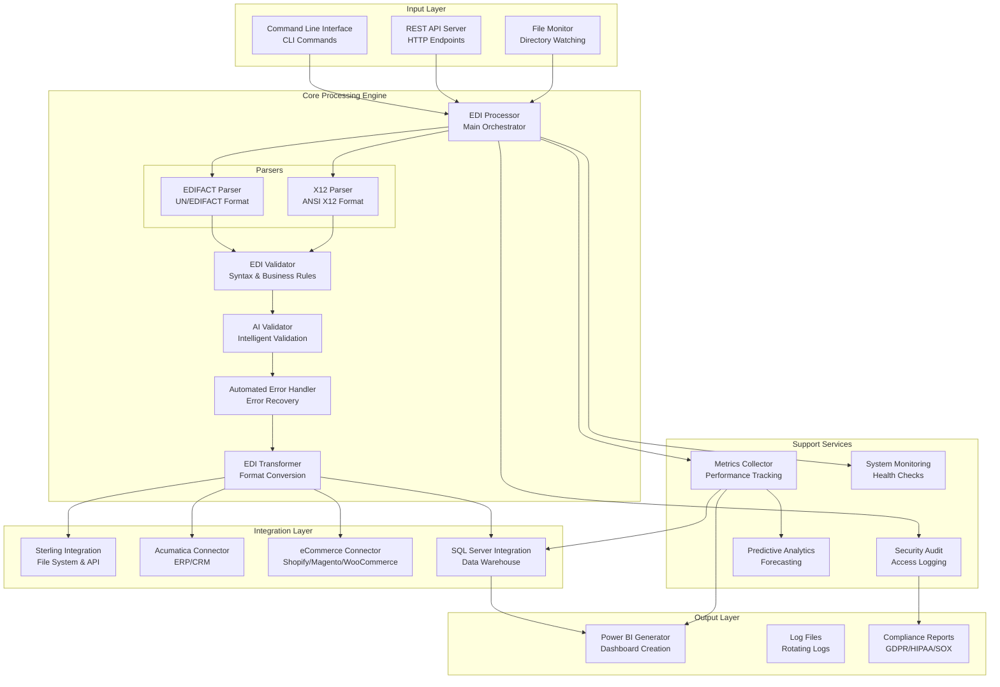

---

## Processing Pipeline

### EDI Processing Flow

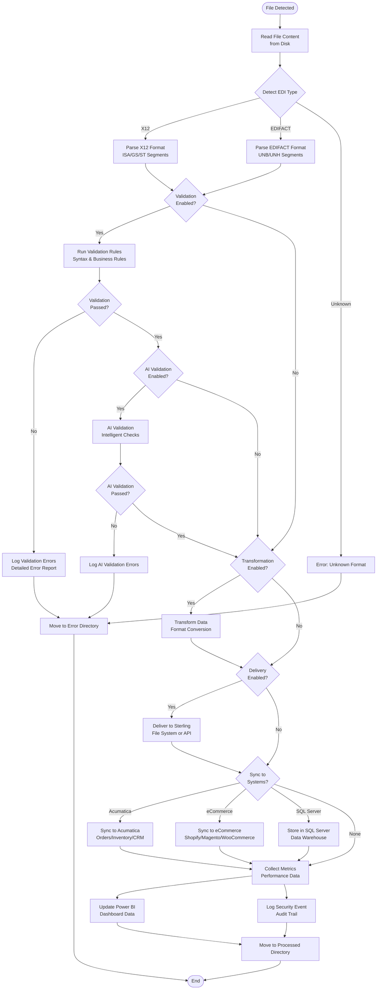

### Error Handling Flow

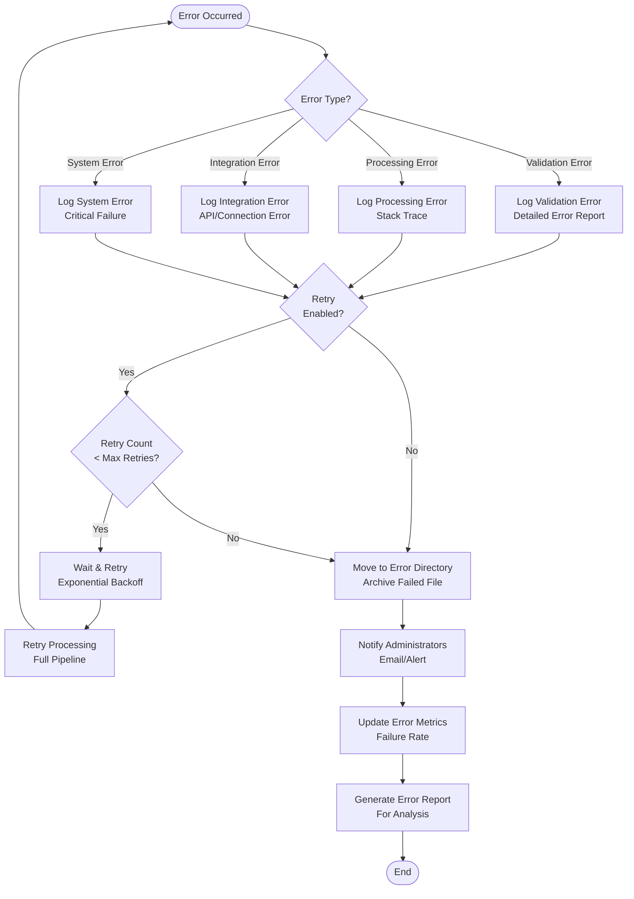

---

## Integration Architecture

### Complete Integration Ecosystem

```mermaid
graph TB
    subgraph center["EDI Application<br/>Central Hub"]
        EDIProcessor["EDI Processor"]
        MetricsCollector["Metrics Collector"]
        SecurityAudit["Security Audit"]
    end
    
    subgraph sterling["IBM Sterling B2B Integrator"]
        SterlingFS["File System<br/>Pickup/Delivery Directories"]
        SterlingAPI["REST API<br/>Document Submission"]
        SterlingConfig["Trading Partner<br/>Configuration"]
    end
    
    subgraph acumatica["Acumatica ERP/CRM"]
        SalesOrders["Sales Orders<br/>SO301000"]
        PurchaseOrders["Purchase Orders<br/>PO301000"]
        Inventory["Inventory<br/>IN202500"]
        Customers["Customers<br/>AR303000"]
        Vendors["Vendors<br/>AP303000"]
        Opportunities["Opportunities<br/>CR304000"]
        Contacts["Contacts<br/>CR302000"]
        Activities["Activities<br/>CR306000"]
    end
    
    subgraph ecommerce["eCommerce Platforms"]
        Shopify["Shopify<br/>Orders/Products"]
        Magento["Magento<br/>Orders/Inventory"]
        WooCommerce["WooCommerce<br/>Orders/Products"]
    end
    
    subgraph data["Data Storage"]
        SQLServer["SQL Server<br/>Data Warehouse"]
        MetricsDB["Metrics Database<br/>SQLite"]
        FileSystem["File System<br/>Processed Files"]
    end
    
    subgraph reporting["Reporting & Analytics"]
        PowerBI["Power BI<br/>Executive Dashboards"]
        ComplianceReports["Compliance Reports<br/>GDPR/HIPAA/SOX"]
        ExecutiveReports["Executive Reports<br/>Monthly/Quarterly"]
    end
    
    EDIProcessor --> SterlingFS
    EDIProcessor --> SterlingAPI
    EDIProcessor --> SterlingConfig
    
    EDIProcessor --> SalesOrders
    EDIProcessor --> PurchaseOrders
    EDIProcessor --> Inventory
    EDIProcessor --> Customers
    EDIProcessor --> Vendors
    EDIProcessor --> Opportunities
    EDIProcessor --> Contacts
    EDIProcessor --> Activities
    
    EDIProcessor --> Shopify
    EDIProcessor --> Magento
    EDIProcessor --> WooCommerce
    
    EDIProcessor --> SQLServer
    MetricsCollector --> MetricsDB
    EDIProcessor --> FileSystem
    
    MetricsDB --> PowerBI
    SQLServer --> PowerBI
    SecurityAudit --> ComplianceReports
    MetricsCollector --> ExecutiveReports
```

### Integration Data Flow

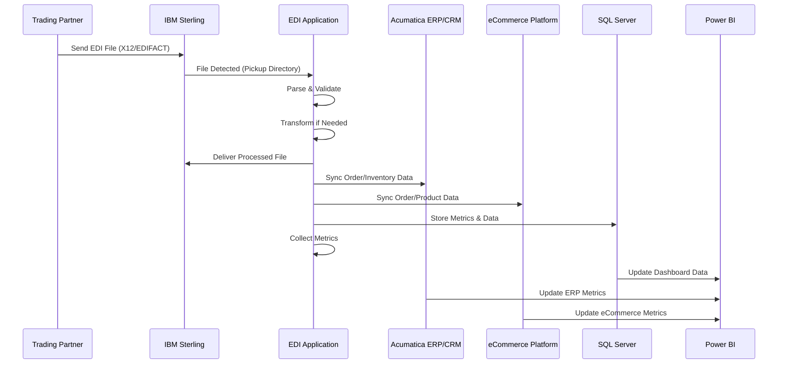

---

## Deployment Architecture

### Docker Deployment Architecture

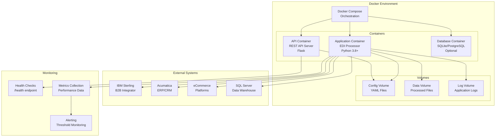

### Network Topology

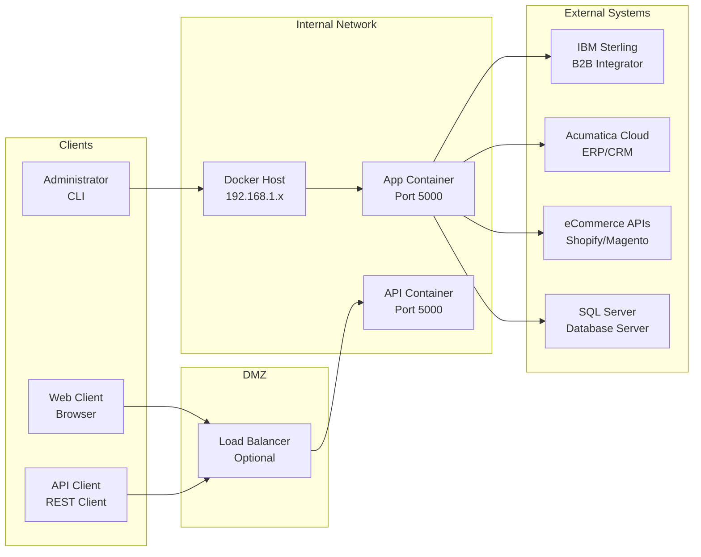

---

## API Architecture

### REST API Request Flow

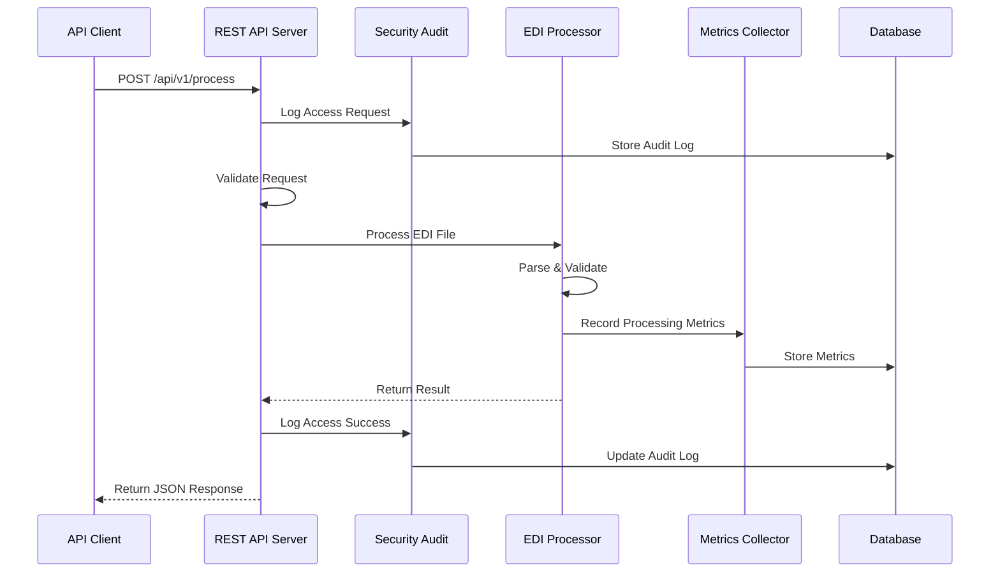

### API Endpoint Architecture

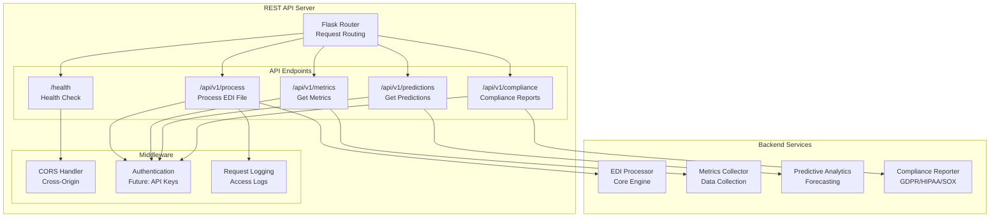

---

## Data Flow Diagrams

### Metrics Collection Flow

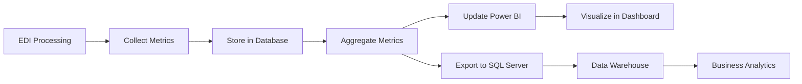

### Security Audit Flow

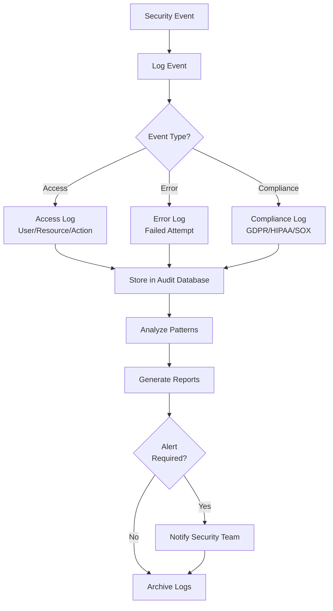

---

## Component Relationships

### Module Dependencies

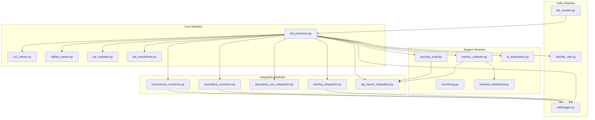

---

## Summary

This visual guide provides comprehensive diagrams covering:

- **System Architecture**: Complete component overview
- **Processing Pipeline**: Step-by-step EDI processing flow
- **Integration Architecture**: All external system connections
- **Deployment Architecture**: Docker and network topology
- **API Architecture**: REST API structure and request flow
- **Data Flow Diagrams**: Metrics, security, and data movement
- **Component Relationships**: Module dependencies and structure

For detailed information about any component, refer to the specific documentation files in the `docs/` directory.

